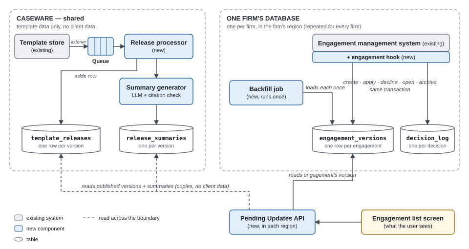

# Pending Template Updates — Design

Options, rationale and worked examples per decision: [`decisions.html`](decisions.html). How AI was used and checked: [`ai-usage.md`](ai-usage.md).

## The core problem

Users need to see which of their engagements have pending template updates, and what those updates change. The difficulty is that the template version an engagement is on is stored only inside the engagement file, and reading it means loading the file (~1 minute, a hard constraint). The template store, shared by all firms, knows nothing about engagements.

So the design keeps a small table per firm recording which template and version each engagement is on. A one-time background job (the *backfill*) fills it by loading every existing engagement once; hooks in the engagement management system keep it current from then on. Every user-facing question is answered from that table and the list of published versions, so no engagement is ever loaded while a user waits.

## Key assumptions

1. Listing a firm's engagements (id, name) is cheap; only reading template/version inside them is slow.
2. An engagement can be loaded just to read its template ID and version, without locking, saving or otherwise changing the client's file (it still takes ~1 min); the stored engagement exposes a revision number.
3. The only ways an engagement's template version changes are creating it and applying an update; both go through the engagement management system (as do declines), so updating our tables from inside those actions is enough to keep them correct.
4. Tables can be added to each firm's existing database; the engagement management system can write to them in the same transaction as the engagement change; firm-scoped credentials can be issued.
5. Versions are numbered monotonically and are cumulative (v5 contains v4's changes); the engagement management system can apply any intermediate version; the template store can list each template's versions.
6. Closed engagements from prior years do not take template updates.
7. "Up-to-date" means correct whenever the user looks; push notifications are an optional extension.

---

## 1. Target Architecture

### How it works for the user

- **At a glance.** Each engagement in the list shows *Up to date*, *N updates pending* or *Verifying…* (its version is not known yet; the engagement itself stays fully usable).
- **What counts as pending.** Any published version of the engagement's template that is newer than the version it is on and newer than anything the user already declined.
- **Accumulated versions, one review.** The user applies everything up to the latest version, or declines; declining offers the previous version, so the user can stop at an intermediate one (versions build on each other: v4 can be taken without v5, not the reverse). A declined version is not offered again.
- **Summaries.** One per version, shown in order: a user on v3 reads what v4 changed, then what v5 changed; a user on v4 reads only v5. Items changed in more than one pending version are marked *changed again*. Summaries are labelled *AI-generated*, never recommend apply or decline, and show *Summary in preparation* until ready.
- **History.** Every apply/decline is recorded: who, when, from which version, to which.

*Example:* an engagement on v3; v4 and v5 are published → *2 updates pending*. The user declines v5 and applies v4 → the engagement is on v4 and v5 is not offered again. v6 ships → *1 update pending*; because v6 builds on v5, its summary also lists v5's changes as *previously declined, would be included*.

### How it is built

| Component | What it does |
|---|---|
| Queue | Keeps each "new version published" message from the template store until it is processed; retries on failure. |
| Release processor | Records each new version and requests its summary. |
| Summary generator | Writes the human-readable summary of each new version (LLM, see below). |
| Engagement hook | Code added to the engagement management system's create / apply / decline / open / archive actions; updates our tables in the same database transaction. |
| Backfill job | Loads each existing engagement once (~1 min) to record its template and version. |
| Pending Updates API | Serves the engagement list by comparing version numbers. |

| Table | Stores | Lives in |
|---|---|---|
| `engagement_versions` | Which template and version each engagement is on, and what the user has declined | Each firm's database |
| `decision_log` | Every apply/decline decision (append-only) | Each firm's database |
| `template_releases` | Every published version of every template | Shared (no client data) |
| `release_summaries` | The summary of each published version and its review status; corrections add a dated revision, never overwrite | Shared (no client data) |

**Flows**

1. **A new version is published.** Listener on the template store → queue → release processor records it in `template_releases` → summary generator stores its summary in `release_summaries`. One row and one summary per release, however many firms use the template; if we are down, the message waits.
2. **A user opens the list.** The API reads the firm's `engagement_versions` and `template_releases` and compares version numbers: a database query, no engagement is loaded.
3. **A user creates, applies or declines.** The engagement hook updates `engagement_versions` and `decision_log` in the same transaction as the engagement change. No queue here: the tables share the firm's database, so the write is all-or-nothing and client data never leaves it. (A database listener would not work: engagements are opaque records.)
4. **Existing engagements.** Engagements created before launch have no events, so their version is unknown. The backfill job loads each one once (~1 min) and records its template and version. If a user opens one first, the engagement management system is already loading it, so the hook records its version at no extra cost and the backfill skips it.

**Summary generation (at publish time).** (1) The diff tool compares the new version with the previous one; each change gets an ID (C1, C2…). (2) The LLM receives two inputs: **the changes**, and **as context, the parts of the previous version that those changes touch** — so it can name things ("procedure 12" is "Lease review") and explain them. The whole template is not sent: it can be very large, and unchanged parts add cost and noise. (3) The LLM writes the summary, citing the change IDs. (4) Code checks that no cited ID is invented and every change is cited; otherwise it retries once, then sends the summary to human review. The *changed again* mark is computed by code, by comparing the paths each version changed. Rules per change type were rejected: the template's internal structure is unknown to us.

**Security.** `engagement_versions` and `decision_log` reveal a firm's clients and activity, so they live inside each firm's existing database and inherit its isolation and data residency. The backfill job uses firm-scoped credentials; the API takes the firm from the session token, never from the request, and reuses existing per-engagement permissions; logs carry IDs only; the service runs in every region that hosts firm data. Only template data is shared; monitoring exports aggregated counts.

## 2. Implementation Plan

Standard online-migration order: create tables, capture new changes, copy existing state, verify, then show users. Each phase ships behind a per-firm feature flag; we only add tables and hooks and never modify an engagement file, so rollback is turning the flag off.

1. **Tables.** `engagement_versions` and `decision_log` in each firm's database (a migration per firm); `template_releases` and `release_summaries` in the shared store. *Done when* migrated for the pilot firms.
2. **Capture new changes.** Enable the engagement hook and the template-store listener; copy the versions already in the template store into `template_releases` once. This goes **before** the backfill, so changes made while it runs are not missed. *Done when* pilot firms show hook writes and `template_releases` matches the template store.
3. **Backfill.** A background job works through each firm's engagements still marked *verifying*, recently opened ones first. It loads each one without changing it (~1 min), records its template, version and revision, and marks it verified; if a user opened or changed an engagement first, the hook already recorded its version and the job does not load it again. After 3 failed loads it is marked `error`, with an alarm. To spare users, it runs mostly off-hours, a limited number at a time, pausing if their load times rise. Size (assumed): ~150,000 engagements ≈ 3 nights at 100 at a time. *Done when* a firm's open engagements are verified or in `error`.
4. **Check before showing.** The Pending Updates API runs but the UI stays off; we query it and reload a sample of engagements to confirm its answers.
5. **Turn it on for users.** Pilot firms first; once they run without problems, the remaining firms in groups.
6. **Summaries (in parallel with 3–5).** Evaluate offline on historical releases; launch with the content team approving every summary before users see it; move to sampled review once summaries are consistently approved without edits.

## 3. Testing Strategy

| Component | What we test | Passes when |
|---|---|---|
| Pending Updates API | Pending logic with accumulated versions (the §1 example); firm taken from the session | Correct pending list; no engagement is ever loaded; firm A never sees firm B |
| Engagement hook | Create / apply / decline, including a failing one | Our tables change only if the engagement change succeeds |
| Backfill job | Run on a copy of a pilot firm, with forced load failures and a user applying mid-run | Every engagement ends verified or in `error`; a newer apply is never overwritten |
| Queue + release processor | The same publish message twice, or out of order | One row per version |
| Summary generator | Citation check, plus a set of past releases graded by the content team | No invented or missing change; a prompt or model change ships only if the grade holds |

## 4. Evaluation & Observability

For each component we measure whether it does its job correctly, not only whether it is running. Thresholds are set in the pilot.

| Component | Doing its job right means | How we measure it in production |
|---|---|---|
| Queue + release processor | No published version is missing | Reconciliation with the template store: versions missing must be zero |
| Engagement hook, backfill and API | Every engagement shows exactly the updates it really has pending | **Drift check:** reload a sample of engagements and compare their real pending updates with what the list shows (mismatches must be zero); backfill coverage per firm; response time flat with firm size |
| `decision_log` | Every decision is recorded | Every version change has a log entry: **each firm's decision history** |
| Post-publish count job | Answers **how many engagements a release affects** | Per region and firm (own credentials, numbers only): engagements pending or still verifying; a missing firm = **check not running for every firm** |

**Evaluating the summaries.** Good means *complete*, *faithful* (nothing invented, meaning right), *clear* to a non-technical auditor and *neutral*; the citation check proves only completeness.

- **Before release:** the graded set of past releases gates every prompt or model change (§3).
- **In production:** at about one summary per product per week, the content team can grade them against these criteria (all at launch, then a sample); we track approvals without edits and edit reasons (omitted, invented, wrong meaning, unclear).
- **Users:** an "accurate?" control and a "wrong summary" flag, confirmed by the content team; alarm on any confirmed error or falling approvals.

**Is the feature useful:** time from publish to decision, and engagements pending for months.

## 5. Failure Modes & Tradeoffs

| Failure → effect | Detected by | Mitigation |
|---|---|---|
| Publish message lost → wrongly *Up to date* | Reconciliation with the template store | Queue retries; reconciliation copies the missing version |
| Summary wrong, invented or incomplete → bad decision | Citation check (invented, omitted); content-team grading and user flags (wrong meaning) | Approved at launch; fixed once for every firm; decisions taken while the wrong revision was live are found by date, so those firms can be told |
| Diff too large for the LLM → no summary | *In preparation* too long | Summarize by section, or the content team writes it |
| Firm-scoping bug → cross-firm leak | Negative tests; access logs | Firm from the session token; tables in each firm's own database |
| Late backfill write after an apply → old version shown | Drift check | Writes carry the revision; older ones are ignored |
| Engagement unloadable or table drift → wrong state | `error` count; drift check | Shown as `error`, never *Up to date*; fixed on next open |

**Tradeoffs accepted** (what we chose over the alternative: what we gain; what we give up)

- **Our own table with each engagement's version over changing the engagement system so it can be read without loading:** that core system stays untouched; the table can disagree with the file (hence the drift check).
- **Computing pending updates when the user opens the list over writing them into every affected engagement when a version is published:** a publish costs one row however many firms use the template; users learn about a new version when they open the list, not through a notification.
- **Loading every existing engagement once at launch (the backfill) over waiting until each one is opened:** no engagement is left with an unknown version; it costs ~150,000 one-minute loads, once.
- **Our tables inside each firm's own database over one central database for all firms:** firm isolation and data residency come from where the data lives; every firm's database needs a migration.
- **Writing our tables in the same transaction as the user's decision over sending an event to process later:** a decision can never be missing from our tables; if our write fails, the user's apply/decline fails too.
- **Reviewing all pending versions together over deciding each version separately:** with v4 and v5 pending, the user applies both in one click, or declines and is offered v4 alone. The cost: versions are cumulative, so if the user declines v5 and later applies v6, v5's changes come in too (the summary warns about it).
- **Summaries written by an LLM over text generated by fixed rules per change type:** readable without knowing the template's internal structure; the LLM can be wrong, hence the citation check and human review.
- **One summary per version over one summary per jump (e.g. v3 → v6):** each is written and reviewed once and shared by all firms; users read the changes version by version, not the net effect (*changed again* marks items changed more than once).
