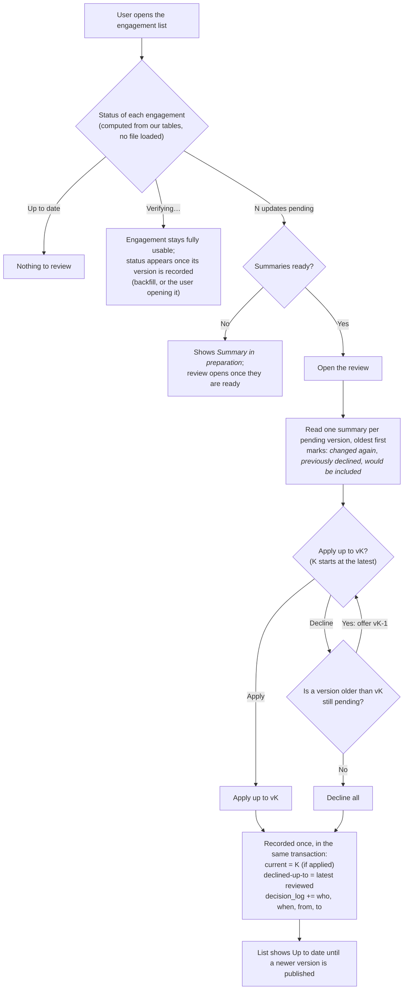
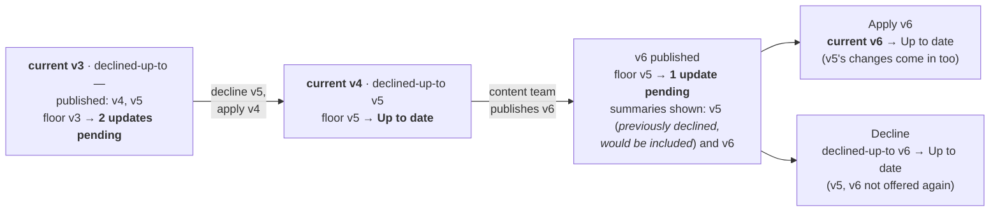
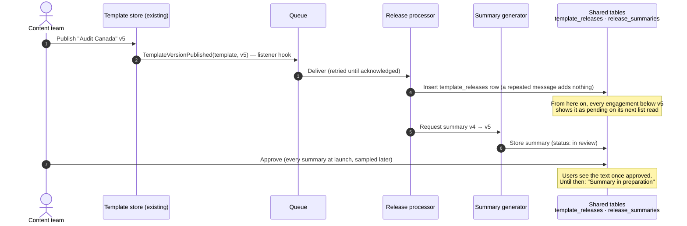
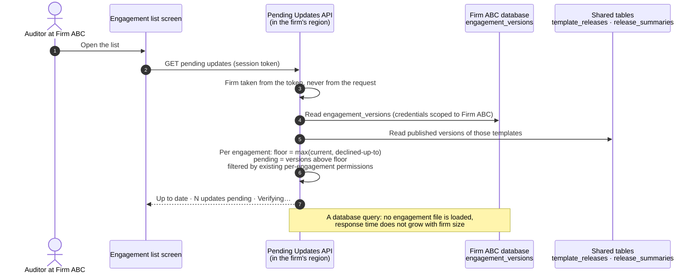
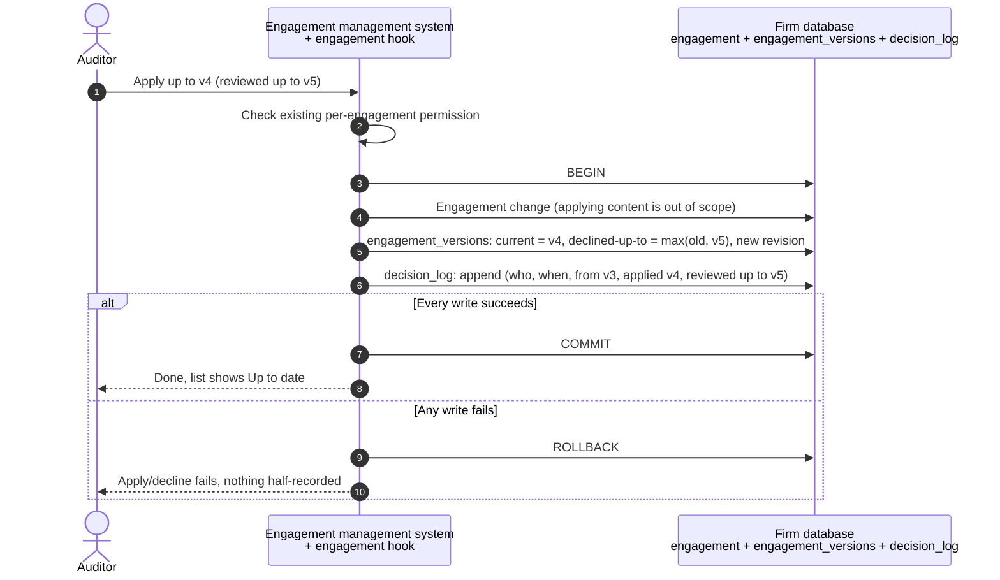
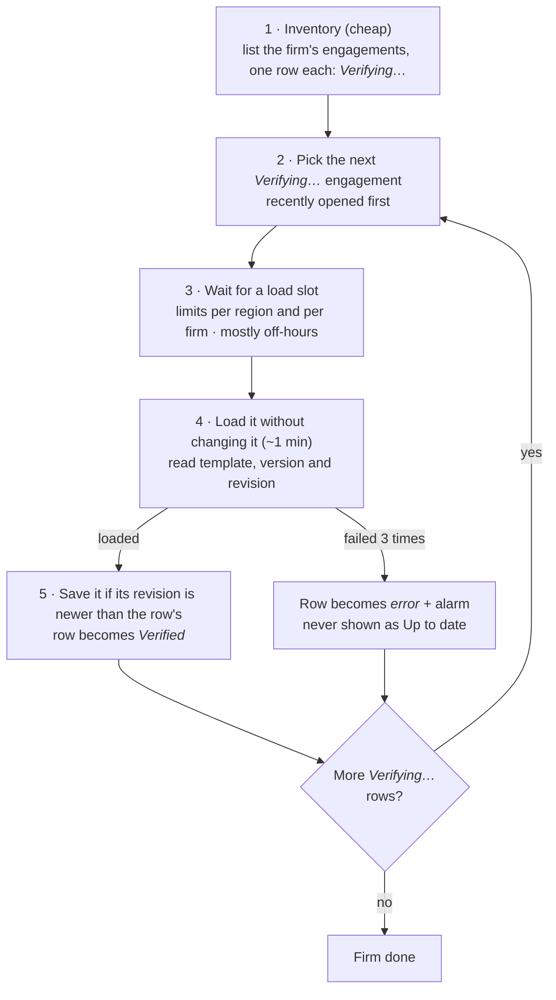
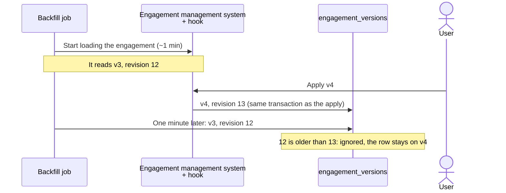
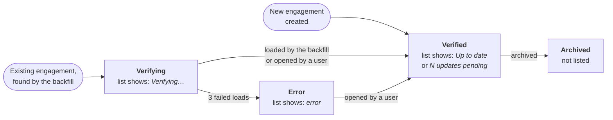
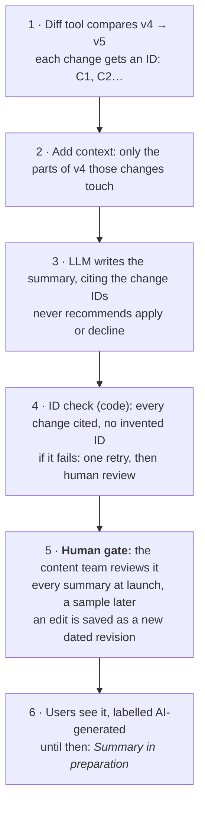
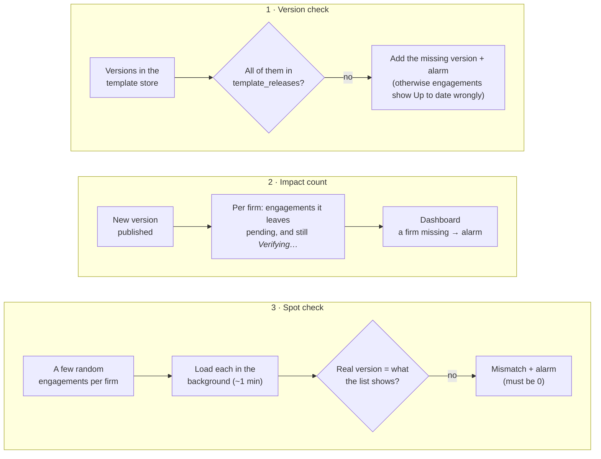

# Flows

How the design in [`design.md`](design.md) behaves, step by step. Terms, tables and components are the ones defined there; decisions are referenced as D-N ([`decisions.html`](decisions.html)). Diagrams are Mermaid and render on GitHub.

1. [What the user sees](#1-what-the-user-sees)
2. [User journey: reviewing pending updates](#2-user-journey-reviewing-pending-updates)
3. [Accumulated updates, worked example](#3-accumulated-updates-worked-example)
4. [A new version is published](#4-a-new-version-is-published)
5. [A user opens the engagement list](#5-a-user-opens-the-engagement-list)
6. [A user applies or declines](#6-a-user-applies-or-declines)
7. [Backfill of existing engagements](#7-backfill-of-existing-engagements)
8. [Lifecycle of an engagement's row](#8-lifecycle-of-an-engagements-row)
9. [Summary generation](#9-summary-generation)
10. [Observability jobs](#10-observability-jobs)

---

## 1. What the user sees

Illustrative wireframe: screen design is not part of the brief, and the summary text below is made up for layout only (real summaries come from the JSON diff, §9). The statuses are the three defined in design §1.

```text
 Engagements — Firm ABC
 ┌──────────────┬────────────────┬─────────┬─────────────────────┐
 │ Engagement   │ Template       │ Version │ Template updates    │
 ├──────────────┼────────────────┼─────────┼─────────────────────┤
 │ Smith 2026   │ Audit Canada   │ v3      │ ● 2 updates pending │
 │ Jones 2026   │ Audit Canada   │ v5      │ ✓ Up to date        │
 │ Brown 2026   │ —              │ —       │ ⏳ Verifying…        │
 └──────────────┴────────────────┴─────────┴─────────────────────┘

 Review — Smith 2026 (v3 → v5)                       [AI-generated]
   What v4 changed   · Procedure "Lease review": new step added (C1)
                     · Checklist "Going concern": question reworded (C2) ⟲ changed again in v5
   What v5 changed   · Checklist "Going concern": question removed (C1)
                                        [ Apply up to v5 ]   [ Decline ]
```

## 2. User journey: reviewing pending updates



Walking back is the only valid order: versions are cumulative, so v5 cannot be applied without v4, but an engagement can stop at v4 (D4). The walk-back steps are UI only; the decision is one event.

## 3. Accumulated updates, worked example

The example from design §1. Pending = published versions newer than both the version the engagement is on and the highest version already declined (written *floor* below).



## 4. A new version is published

One row and one summary per release, however many firms use the template. No firm database is touched and no engagement is loaded.



Step 6 is expanded in [§9](#9-summary-generation). A lost message is caught by the version check ([§10](#10-observability-jobs)).

## 5. A user opens the engagement list



## 6. A user applies or declines

Also covers create, open and archive: the same hook, inside the engagement management system, writes our tables in the firm's own database.



| Action | Effect on `engagement_versions` |
|---|---|
| Create | Row inserted: template, version, *verified* |
| Open | Version recorded for free (the load was already paid by the user); *verified* |
| Apply / decline | As above, plus a `decision_log` entry |
| Archive | Status *archived* (kept, so a late backfill write cannot bring it back) |

## 7. Backfill of existing engagements

The backfill fills `engagement_versions` for the engagements that existed before launch. It runs once per firm, in the firm's region, with that firm's credentials. Each load takes about a minute, so it goes slowly on purpose and must never slow users down.



An engagement the user has created, opened or decided on is already *Verified* by the hook, so the backfill never picks it.

**A reading can arrive late; it does no harm.** In the minute a load takes, the user may apply an update. Every write carries the engagement's own revision number, and a write older than the one the row holds is ignored:



Order of rollout (design §2): the hook and the template-store listener are switched on **before** the backfill, so any change made while it runs is already captured.

## 8. Lifecycle of an engagement's row

Each engagement has one row in `engagement_versions`, in one of four states. *Up to date* and *N updates pending* are not states: they are computed from a *Verified* row every time the list is read.



Apply, decline and open keep a row *Verified* and update it. An engagement can be archived from any state; the row is kept, not deleted, so a late backfill reading cannot bring it back.

## 9. Summary generation

One summary per new version, comparing it with the previous version, written once for every firm. Steps 1–4 run automatically when the version is published; step 5 is a person. The LLM only ever sees Caseware template content, never firm data.



The same flow on a made-up change (illustration only; real content always comes from the diff):

| Step | Example |
|---|---|
| 1 · Diff | `C1`: a step was added to procedure 12 |
| 2 · Context | procedure 12 is titled "Lease review" |
| 3 · Summary | Procedure "Lease review": new step added (C1) |
| 4 · ID check | C1 is cited and nothing else is: passes |

*Changed again* marks are not part of generation: when a review shows several versions, code compares the paths each version changed and marks the items changed in more than one.

## 10. Observability jobs

Three jobs check that the system is right, not only that it is running: the version check and the spot check run on a schedule, the impact count after each publish. They run in each region with firm-scoped credentials, and only counts leave the region.



| Brief question | Answered by |
|---|---|
| How many engagements a new update affects | Impact count, per firm and region |
| Whether the check is running for every firm | A firm missing from the impact count or with no spot-check result; backfill progress |
| A firm's history of apply/decline decisions | `decision_log` (who, when, from, to): a query, not a job |
